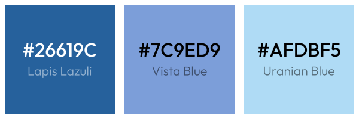

# NimaOS Logo

This logotype is made by [David Lapshin](https://daudix.one).

## Logo

| Logotype - light                      | Logotype - dark                     | Logotype - light (monochrome)                   | Logotype - dark (monochrome)                  |
|---------------------------------------|-------------------------------------|-------------------------------------------------|-----------------------------------------------|
|  |  |  |  |

| Logomark                            | Logomark light (monochrome)                               | Logomark dark (monochrome)                    |
|-------------------------------------|-----------------------------------------------------------|-----------------------------------------------|
|  |  |  |

## Palette

## Font

The font used in this logo is [Outfit](https://fonts.google.com/specimen/Outfit), in "medium" and "light" weights for "Nima" and "OS" respectively.
